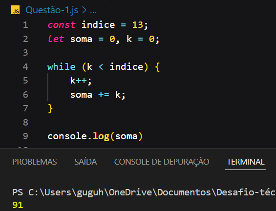
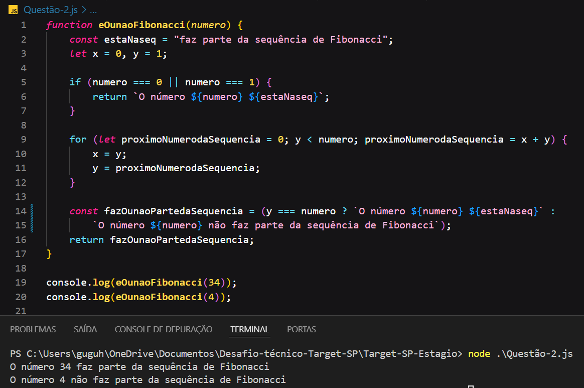
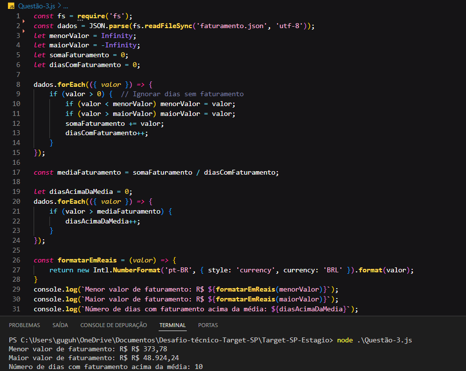
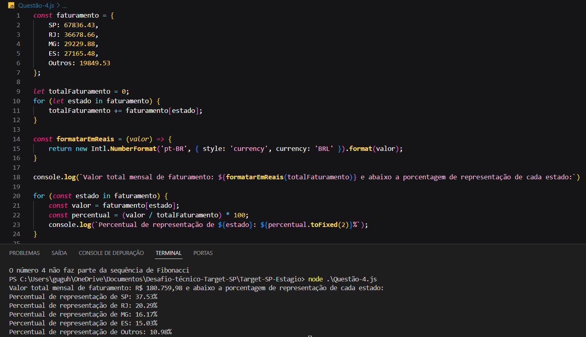
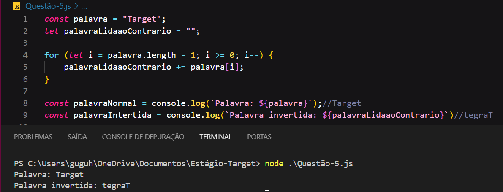

                   🚀 Desafio de Estágio para Desenvolvedor - Target

A seguir, detalho cada questão e a respectiva solução, acompanhada da lógica de processamento e exemplos.

📋 Questão 1 - Valor da Variável SOMA
Descrição
Observe o trecho de código abaixo:

int INDICE = 13, SOMA = 0, K = 0;

while (K < INDICE) {
    K = K + 1;
    SOMA = SOMA + K;
}

console.log(SOMA);

Pergunta
Ao final do processamento, qual será o valor da variável SOMA?

Resposta
A variável SOMA ao final do processamento será 91, pois o código incrementa a variável K de 1 a 13, somando seu valor a SOMA a cada iteração.

Lógica de Processamento:

                 Questão 2 - Sequência de Fibonacci
Dado a sequência de Fibonacci, onde se inicia por 0 e 1 e o próximo valor sempre será a soma dos 2 valores anteriores (exemplo: 0, 1, 1, 2, 3, 5, 8, 13, 21, 34...), escreva um programa na linguagem que desejar onde, informado um número, ele calcule a sequência de Fibonacci e retorne uma mensagem avisando se o número informado pertence ou não a sequência.

IMPORTANTE: Esse número pode ser informado através de qualquer entrada de sua preferência ou pode ser previamente definido no código;

Lógica de Processamento:

 
                📈 Questão 3 - Faturamento Diário
Descrição
Dado um vetor que guarda o valor de faturamento diário de uma distribuidora, faça um programa que calcule e retorne:

O menor valor de faturamento ocorrido em um dia do mês;
O maior valor de faturamento ocorrido em um dia do mês;
O número de dias no mês em que o valor de faturamento diário foi superior à média mensal.
Requisitos
Usar dados de faturamento mensal em formato JSON ou XML.
Desconsiderar dias sem faturamento, como finais de semana e feriados.

Lógica de Processamento:

		  
			  

                Questão 4 - Percentual de Representação por Estado
Descrição
Dado o valor de faturamento mensal de uma distribuidora detalhado por estado, escreva um programa que calcule o percentual de representação de cada estado dentro do valor total mensal.

Faturamento por Estado
SP – R$ 67.836,43
RJ – R$ 36.678,66
MG – R$ 29.229,88
ES – R$ 27.165,48
Outros – R$ 19.849,53
			  
Escreva um programa na linguagem que desejar onde calcule o percentual de representação que cada estado teve dentro do valor total mensal da distribuidora. 

Lógica de Processamento:

             Questão 5 Escreva um programa que inverta os caracteres de uma string.
IMPORTANTE:
a) Essa string pode ser informada através de qualquer entrada de sua preferência ou pode ser previamente definida no código;
b) Evite usar funções prontas, como, por exemplo, reverse;

Lógica de Processamento:

